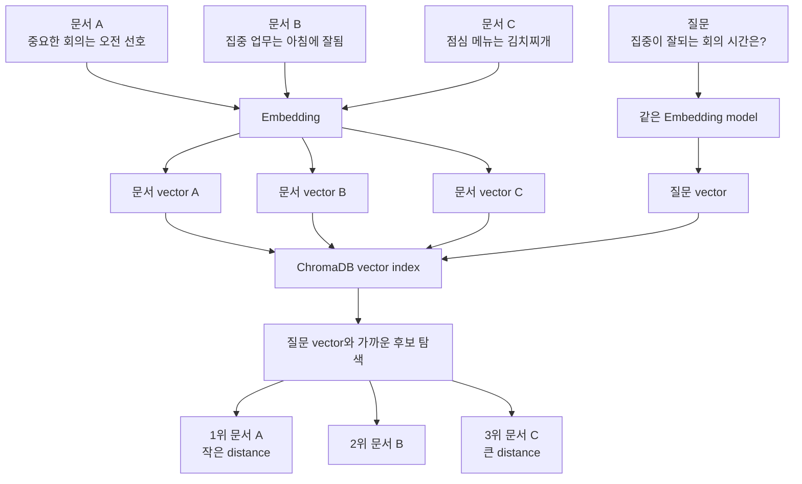

# Week 4 스터디 & ADR — 출처를 구분하는 기억 검색

- 대상 과제 파일: `student_parts/week04_retrieve_nanas_memory.py`
- 브랜치: `junyoung/week4` (base = 최신 `junyoung/final` + `main` 강의자료)
- 범위: **Week 4 메인 과제 완료**, 강의 추가 과제는 보류
- 구현 커밋: `c009d2f`

이 문서는 구현 코드의 동작을 설명하고, 구현 과정에서 선택한 설계의 배경·결정·결과를 ADR로 기록한다.

---

## 1. 이번 주 한 일

Week 3에서는 자연어 요청을 구조화해 SQLite에 저장했다. Week 4 메인 과제에서는 저장된 정보를 질문의 성격에 맞는 출처에서 다시 찾도록 확장했다.

구현한 기능은 다음 세 가지다.

1. `add_personal_reference`: 개인 선호·메모·참고자료를 ChromaDB에 저장한다.
2. `search_personal_references`: 자연어 의미가 가까운 개인 참고자료를 vector search로 찾는다.
3. `search_saved_requests`: Week 3에서 SQLite에 저장한 일정·할 일·알림을 문자열 조건으로 찾는다.

이전 주차 멘토 리뷰에서 확인한 실패 입력과 반환 계약 문제를 반복하지 않도록, 공백뿐인 필수 입력을 차단하고 저장소가 식별자 없는 결과를 반환하면 성공 응답으로 바꾸지 않는 guard도 추가했다.

전체 흐름은 다음과 같다.

```text
사용자 질문
  │
  ├─ 개인 선호·메모를 새로 기억해야 함
  │    └─ add_personal_reference
  │         └─ OpenAI embedding 생성 → ChromaDB 저장
  │
  ├─ 개인 선호·메모를 찾아야 함
  │    └─ search_personal_references
  │         └─ query embedding → ChromaDB vector search → hits
  │
  └─ 저장된 일정·할 일·알림을 찾아야 함
       └─ search_saved_requests
             └─ SQLite LIKE 검색 → rows
```

---

## 2. 먼저 이해할 개념

### 2.1 RAG는 검색 결과를 답변 근거로 제공하는 구조다

RAG(Retrieval-Augmented Generation)는 LLM이 답을 만들기 전에 외부 저장소에서 관련 정보를 검색하고, 그 검색 결과를 답변 근거로 사용하게 하는 방식이다.

Week 4의 흐름을 단계로 나누면 다음과 같다.

```text
질문 입력
  → 질문에 맞는 검색 tool 선택
  → 저장소에서 관련 데이터 조회
  → tool이 JSON 결과 반환
  → LLM이 검색 결과를 읽고 최종 답변 작성
```

중요한 점은 LLM이 ChromaDB나 SQLite를 직접 읽지 않는다는 것이다. LLM은 어떤 tool을 호출할지 결정하고, Python tool이 저장소를 조회한 뒤 반환한 JSON만 읽는다.

### 2.2 이번 메인 과제에는 서로 다른 두 검색 방식이 있다

| 구분 | 개인 참고자료 | 저장된 일정·할 일·알림 |
|---|---|---|
| Tool | `search_personal_references` | `search_saved_requests` |
| 저장소 | ChromaDB | SQLite |
| 검색 방식 | embedding 기반 vector search | `LIKE` 기반 문자열 검색 |
| 반환 최상위 키 | `hits` | `rows` |
| 적합한 질문 | 표현이 달라도 의미가 비슷한 메모 검색 | 저장 당시 제목·이유·원문에 포함된 핵심어 검색 |

두 검색을 모두 “기억 검색”이라고 부를 수 있지만 내부 동작은 다르다.

- ChromaDB 검색은 질문과 참고자료를 vector로 바꾼 뒤 거리로 관련성을 계산한다.
- SQLite 검색은 `raw_json`, `title`, `reason`에 query 문자열이 포함됐는지 확인한다.

따라서 `search_saved_requests`를 vector RAG라고 설명하면 실제 구현과 맞지 않는다. 이 도구는 구조화 데이터 저장소를 직접 검색하는 retrieval tool이다.

### 2.3 embedding과 distance

embedding은 텍스트의 특징을 숫자 배열(vector)로 표현한 값이다. 개인 참고자료를 추가할 때 문서 embedding을 저장하고, 검색할 때 질문 embedding과 저장된 vector 사이의 거리를 계산한다.

`PersonalReferenceStore.search_personal_references()`가 반환하는 `distance`는 ChromaDB 검색 결과의 원본 값이다. 이 값은 임의로 유사도 점수로 변환하지 않고 그대로 tool 결과에 포함했다. collection의 거리 metric에 따라 해석 방식이 달라질 수 있으므로, 현재 코드는 결과 순서를 유지하고 distance는 비교·디버깅 정보로 제공한다.

## 3. 구현 해설

각 항목은 **코드 → 동작 → 구현 의도 → 구현 근거** 순서로 정리한다.

### 3.1 `safe_limit` — 검색 결과 개수의 경계 보정

**코드**

```python
def safe_limit(limit: int | str | None, default: int = 5, maximum: int = 50) -> int:
    if maximum < 1:
        raise ValueError(...)
    fallback = max(1, min(int(default), maximum))
    try:
        value = int(limit)
    except (TypeError, ValueError):
        value = fallback
    return max(1, min(value, maximum))
```

**동작**

1. 입력을 `int`로 변환한다.
2. 변환할 수 없거나 `None`이면 안전 범위로 보정한 기본값을 사용한다.
3. 최소 1, 최대 `maximum` 범위로 제한한다.
4. `maximum` 자체가 1보다 작으면 잘못된 helper 사용이므로 즉시 오류를 낸다.

예를 들어 참고자료 검색의 최대값이 20이면 `safe_limit(100, default=2, maximum=20)`은 20을 반환한다. 0이나 음수는 1로 보정된다.

**구현 의도**

`top_k`가 지나치게 크면 불필요한 검색 결과가 tool 응답에 포함되고 LLM context도 커진다. 최소·최대 범위를 한 helper에서 처리해 도구마다 같은 제한 방식을 사용하게 했다.

Pydantic `args_schema`도 `ge`/`le`로 범위를 검증한다. `safe_limit`은 정상적인 LangChain tool 호출에서는 두 번째 방어선이고, helper나 함수가 직접 재사용되는 경로까지 고려한 방어 코드다. 문자열이나 `None`도 실제 보정 대상이므로 함수 annotation에도 허용 타입을 그대로 적었다.

**구현 근거**

- 과제 요구: tool 내부에서 `safe_limit()`으로 `top_k`를 안전한 범위로 정리한다.
- 현재 범위: 참고자료는 1~20, 저장 요청은 1~50으로 제한한다.

---

### 3.2 `add_personal_reference_dict` — 저장소 호출과 응답 구성

**코드**

```python
def add_personal_reference_dict(reference_store, *, title, content, tags=None):
    normalized_title = _require_non_empty_text(title, field_name="title")
    normalized_content = _require_non_empty_text(content, field_name="content")
    normalized_tags = _normalize_tags(tags)
    reference = reference_store.add_personal_reference(
        title=normalized_title,
        content=normalized_content,
        tags=normalized_tags,
    )
    if not isinstance(reference, dict):
        raise TypeError(...)
    if not isinstance(reference.get("reference_id"), str):
        raise ValueError(...)
    return {
        "reference_backend": reference_store.backend_info(),
        "reference": reference,
    }
```

**동작**

- title과 content 양끝 공백을 제거하고 공백만 남으면 저장을 거부한다.
- tag의 양끝 공백과 빈 tag를 제거하고, 입력 순서를 유지하면서 중복을 없앤다.
- `PersonalReferenceStore.add_personal_reference()`에 저장을 위임한다.
- 반환값이 dict이고 비어 있지 않은 `reference_id`가 있는지 확인한다.
- 저장된 참고자료와 backend 정보를 함께 반환한다.

실제 store는 새 `reference_id`를 만들고, content의 embedding을 생성해 ChromaDB collection에 저장한다. metadata에는 title과 tags가 들어간다.

**구현 의도**

helper가 전역 `REFERENCE_STORE`에 직접 의존하지 않고 `reference_store`를 인자로 받게 했다. 실제 앱에서는 ChromaDB store를 전달하고, 단위 테스트에서는 외부 API를 호출하지 않는 fake store를 전달할 수 있다.

입력 schema만 믿지 않고 helper에서도 필수 문자열을 확인한다. LangChain tool을 거치지 않고 helper를 직접 호출하는 테스트나 향후 재사용 경로에서도 같은 계약을 지키기 위해서다. store가 `{}` 같은 값을 반환했는데 그대로 성공 JSON으로 감싸면 agent가 저장 완료로 오해할 수 있으므로, 저장 성공을 식별하는 `reference_id`도 경계에서 확인한다. 오류에는 type과 길이를 제한한 `repr(value)`를 넣어 실제 문제 값을 진단할 수 있게 했다.

`reference_backend`에는 vector store 종류, embedding model, collection 이름 등이 들어간다. 저장 결과가 어느 backend에서 만들어졌는지 trace에서 확인할 수 있다.

**구현 근거**

- 과제 요구: title/content/tags를 store에 전달하고 `tags=None`은 빈 list로 바꾼다.
- 과제 반환 계약: `reference_backend`와 `reference`를 포함한다.

---

### 3.3 `add_personal_reference` — LangChain tool 경계

**코드**

```python
RequiredText = Annotated[
    str,
    StringConstraints(strip_whitespace=True, min_length=1),
]

class AddPersonalReferenceInput(BaseModel):
    title: RequiredText
    content: RequiredText
    tags: list[str] | None = None

@tool(args_schema=AddPersonalReferenceInput)
def add_personal_reference(title, content, tags=None) -> str:
    return json_payload(
        add_personal_reference_dict(
            REFERENCE_STORE,
            title=title,
            content=content,
            tags=tags,
        )
    )
```

**동작**

1. LangChain이 `AddPersonalReferenceInput`으로 입력 양끝 공백을 제거하고 빈 title/content를 거부한다.
2. helper에 전역 ChromaDB store와 검증된 값을 전달한다.
3. helper가 반환한 dict를 한글이 보존되는 JSON 문자열로 바꾼다.

**구현 의도**

tool 본문에는 저장 방식이나 metadata 변환 로직을 넣지 않았다. tool은 입력 검증과 JSON 반환 경계만 담당하고, 실제 저장 흐름은 helper와 store에 둔다.

이 분리는 단위 테스트를 단순하게 한다. helper는 일반 Python 함수로 테스트할 수 있고, tool은 `.invoke()`를 통해 JSON 계약만 별도로 확인할 수 있다.

**구현 근거**

- 과제 요구: helper 결과를 `json_payload()`로 감싼 문자열로 반환한다.
- Week 3에서 사용한 “tool은 얇은 입구” 구조를 그대로 유지했다.

---

### 3.4 `search_personal_reference_hits` — store 결과를 tool 계약으로 변환

**코드**

```python
rows = reference_store.search_personal_references(query, limit=top_k)
if not isinstance(rows, list):
    raise TypeError(...)

hits = []
for index, row in enumerate(rows):
    if not isinstance(row, dict):
        raise TypeError(...)
    if not row.get("id") or not row.get("content"):
        raise ValueError(...)
    hits.append({...})
return hits
```

**동작**

`PersonalReferenceStore`의 검색 결과는 `id`, `title`, `content`, `tags`, `distance`가 같은 단계에 있는 dict다. helper는 이를 다음 형태로 바꾼다.

```json
{
  "id": "ref_...",
  "content": "중요한 회의는 오전을 선호한다.",
  "distance": 0.12,
  "metadata": {
    "title": "집중 시간",
    "tags": "preference,meeting"
  }
}
```

**구현 의도**

검색 본문과 검색 결과의 설명 정보를 분리했다.

- `content`: LLM이 답변 근거로 읽는 문서 본문
- `metadata`: 문서 제목과 분류 정보
- `distance`: vector 검색 결과를 확인하는 값

title과 tags는 부가 metadata이므로 누락되면 빈 문자열로 처리해 응답 key를 유지한다. 반면 id와 content는 각각 근거의 식별자와 본문이므로 필수다. 둘 중 하나가 없으면 빈 hit를 정상 결과처럼 만들지 않고, row 위치와 실제 값을 포함한 오류를 낸다. 검색 순서와 distance는 store가 반환한 그대로 유지한다.

**구현 근거**

- 과제 반환 계약: hit에 `id`, `content`, `distance`, `metadata(title/tags)`가 있어야 한다.
- 프로젝트 판단: store 내부 형식을 외부 tool 계약으로 직접 노출하지 않고 helper에서 명시적으로 변환한다.

---

### 3.5 `search_personal_references` — `hits` 계약 유지

**코드**

```python
@tool(args_schema=SearchPersonalReferencesInput)
def search_personal_references(query: str, top_k: int = 2) -> str:
    normalized_top_k = safe_limit(top_k, default=2, maximum=20)
    hits = search_personal_reference_hits(
        REFERENCE_STORE,
        query=query,
        top_k=normalized_top_k,
    )
    return json_payload({"hits": hits})
```

**동작과 의도**

- `top_k`를 보정한 뒤 검색 helper를 호출한다.
- 최상위 JSON key를 항상 `hits`로 유지한다.
- 검색 결과가 없으면 예외 대신 `{"hits": []}`를 반환한다.

최상위 key를 고정하면 LLM과 trace를 읽는 코드가 결과 형태를 예측할 수 있다. 검색 성공 여부를 별도 boolean으로 만들지 않고, `hits`의 내용으로 결과 유무를 표현한다.

**구현 근거**

- 과제에서 지정한 course repo 계약이 `{"hits": [...]}`다.
- 빈 검색 결과는 실패가 아니라 정상적인 조회 결과로 취급한다.

---

### 3.6 `search_saved_request_rows` — SQLite 검색의 얇은 helper

**코드**

```python
def search_saved_request_rows(sqlite_store, *, query, top_k=3):
    normalized_query = _require_non_empty_text(query, field_name="query")
    rows = sqlite_store.search_saved_requests(normalized_query, limit=top_k)
    if not isinstance(rows, list):
        raise TypeError(...)
    for index, row in enumerate(rows):
        if not isinstance(row, dict) or not row.get("request_id"):
            raise ValueError(...)
    return rows
```

**동작**

`AppSQLiteStore.search_saved_requests()`는 `structured_requests` 테이블의 `raw_json`, `title`, `reason`에서 query를 `LIKE`로 검색하고 최신순으로 제한한다. helper는 공백 query가 필터 없는 최신 목록 조회로 바뀌지 않도록 먼저 차단하고, 반환된 각 row에 `request_id`가 있는지도 확인한다.

메서드 시그니처는 다음과 같다.

```python
search_saved_requests(query, kind=None, limit=5)
```

따라서 `top_k`는 `limit=top_k`처럼 키워드 인자로 전달해야 한다. `search_saved_requests(query, top_k)`처럼 두 번째 위치 인자로 넘기면 `top_k`가 limit이 아니라 `kind`에 들어간다.

**구현 의도**

helper는 검색 정책을 새로 만들지 않고 기존 SQLite store의 계약을 그대로 사용한다. 결과의 `raw_json` 등 근거 필드도 제거하지 않는다. 다만 반환 계약이 깨졌을 때 식별자 없는 row를 정상 검색 결과로 전달하지 않는 guard만 담당한다.

**구현 근거**

- 과제 요구: `AppSQLiteStore.search_saved_requests(query, limit)`를 호출한다.
- 실제 Python 시그니처를 확인해 `limit`을 키워드로 명시했다.

---

### 3.7 `search_saved_requests` — `rows` 계약 유지

**코드**

```python
@tool(args_schema=SearchSavedRequestsInput)
def search_saved_requests(query: str, top_k: int = 3) -> str:
    normalized_top_k = safe_limit(top_k, default=3, maximum=50)
    rows = search_saved_request_rows(
        SQLITE_STORE,
        query=query,
        top_k=normalized_top_k,
    )
    return json_payload({"rows": rows})
```

**동작과 의도**

- 검색 결과 제한을 1~50으로 보정한다.
- SQLite 결과를 최상위 `rows`에 담는다.
- 결과가 없으면 `{"rows": []}`를 반환한다.

개인 참고자료는 `hits`, 구조화 저장 요청은 `rows`로 구분한다. 이 차이는 단순한 이름 차이가 아니라 vector search 결과와 DB row의 출처가 다르다는 것을 나타낸다.

---

### 3.8 `week04_tools` — 구현된 메인 도구만 공개

**코드**

```python
def week04_tools() -> list[Any]:
    return [
        *week03_tools(),
        add_personal_reference,
        search_personal_references,
        search_saved_requests,
    ]
```

starter 코드에는 추가 과제인 `search_conversation_messages`도 목록에 있었다. 이번 구현은 메인 과제만 진행했으므로 해당 tool을 목록에서 제외했다.

함수 자체의 스텁은 파일에 남아 있지만 agent는 `week04_tools()`에 포함된 tool만 볼 수 있다. 따라서 사용자가 과거 대화를 묻더라도 미구현 함수가 선택되어 `...`를 반환하는 경로는 생기지 않는다.

이 결정은 추가 과제를 삭제한 것이 아니다. 나중에 추가 과제를 구현한다면 helper와 tool을 완성하고 테스트한 뒤 목록에 다시 추가할 수 있다.

---

### 3.9 `week04_prompt_parts` — 질문과 검색 출처 연결

프롬프트에는 다음 선택 규칙을 추가했다.

```text
개인 선호·메모·참고자료 저장
  → add_personal_reference

개인 참고자료가 출처라고 명확한 질문
  → search_personal_references

저장한 일정·할 일·알림이 출처라고 명확한 질문
  → search_saved_requests

과거에 말한 내용을 묻지만 출처가 애매한 질문
  → search_personal_references + search_saved_requests

실제 일정과 개인 선호를 비교하는 질문
  → search_personal_references + search_saved_requests

일정·할 일·알림 저장 요청
  → Week 3의 구조화 및 SQLite 저장 도구
```

**구현 의도**

“기억해 줘”라는 표현만 보면 개인 참고자료 저장과 일정 저장이 겹칠 수 있다. 그래서 데이터 종류를 기준으로 경계를 명시했다.

- 선호·메모·참고자료는 ChromaDB 개인 참고자료로 저장한다.
- 일정·할 일·알림은 기존 Week 3 구조화/SQLite 저장 흐름을 유지한다.

처음에는 LLM이 질문 하나에 검색 tool 하나를 고르는 식으로 동작했다. 실제 앱에서 “내가 발표 연습하기 편하다고 했던 시간이 언제였지?”라는 질문이 개인 참고자료가 아니라 일정 검색으로만 전달되어, 이미 저장된 참고자료를 찾지 못하는 사례가 나왔다. ChromaDB 저장 직후 6~7초가 지난 상태였고 이후 같은 자료가 정상 검색되었으므로 저장 속도 문제가 아니라 출처 선택 문제로 판단했다.

개선한 규칙은 다음과 같다.

- 질문이 특정 출처를 명시하면 해당 검색 tool만 호출한다.
- 과거 정보를 회상하지만 출처를 확정할 수 없으면 두 검색 tool을 모두 호출한다.
- 실제 일정과 개인 선호를 비교하는 질문도 두 검색 tool을 모두 호출한다.
- “언제”, “시간”이라는 단어만으로 일정 검색을 단정하지 않는다.
- 한쪽 결과가 비어 있어도 다른 쪽을 조회하기 전에 기록이 없다고 답하지 않는다.
- 이전 assistant가 찾지 못했다고 한 답변 자체를 기록 부재의 근거로 삼지 않는다.

두 검색 결과는 합쳐서 재정렬하지 않는다. 개인 참고자료의 `hits`와 구조화 요청의 `rows`를 각각 유지한 채 agent가 필요한 근거를 골라 답변한다. 이 방식은 starter 안내의 “LLM이 질문 성격에 따라 둘 중 하나 또는 둘 다 선택”한다는 범위 안에 있다.

---

## 4. 코드 공부 보충 Q&A — 실제 대화에서 궁금했던 내용

이 장은 미리 예상한 일반 질문이 아니라, Week 4 구현 계획과 코드를 함께 읽으면서 실제로 궁금했던 내용을 중심으로 정리한다.

### Q1. 개인 참고자료를 저장할 때 embedding vector도 반환 JSON에 같이 저장되는가?

ChromaDB 내부에는 저장되지만, agent에게 반환하는 JSON에는 넣지 않는다.

`PersonalReferenceStore.add_personal_reference()`는 ChromaDB에 다음 값을 전달한다.

```python
self.collection.add(
    ids=[reference_id],
    documents=[content],
    metadatas=[{"title": title, "tags": ",".join(tags or [])}],
)
```

코드가 `embeddings=[...]`를 직접 넘기지는 않는다. 대신 collection을 만들 때 등록한 `OpenAIEmbeddingFunction`이 `content`를 숫자 vector로 변환하고, ChromaDB가 그 vector를 내부 index에 저장한다.

```text
content
  → OpenAI embedding API
  → 고차원 숫자 vector
  → ChromaDB 내부 저장·index 구성
```

개념적으로 ChromaDB에는 다음 정보가 함께 저장된다.

```text
id        = ref_...
document  = "중요한 회의는 오전을 선호한다."
metadata  = {title: "회의 시간 선호", tags: "preference,meeting"}
embedding = [0.012, -0.037, 0.081, ...]
```

하지만 tool 반환 JSON에는 `id`, `content`, `metadata`, `distance`만 넣는다.

```json
{
  "id": "ref_...",
  "content": "중요한 회의는 오전을 선호한다.",
  "distance": 0.18,
  "metadata": {
    "title": "회의 시간 선호",
    "tags": "preference,meeting"
  }
}
```

원본 embedding은 숫자가 매우 많아 payload가 커지고, LLM이 숫자 배열을 직접 읽어도 답변 작성에는 거의 도움이 되지 않는다. vector는 ChromaDB가 검색할 때 사용하고, agent는 검색된 원문과 거리만 받는 구조다.

### Q2. 사용자가 “개인 참고자료로 저장해 줘”라고 정확히 말하지 않으면 아무것도 저장되지 않는가?

정확한 문구를 문자열로 검사하는 구조는 아니다. LLM이 system prompt, tool 이름·설명, 현재 질문과 대화 문맥을 보고 저장 의도를 판단한다.

다음 표현은 참고자료 저장 요청으로 해석될 가능성이 높다.

```text
이거 기억해 둬.
앞으로 중요한 회의는 오전에 잡는 걸로 알아 둬.
내 선호로 기록해 줘.
나중에 물어보면 알려줘.
```

반면 다음 질문은 참고자료를 저장하지 않고 일반 답변만 만들 가능성이 높다.

```text
오전 회의의 장점은 뭐야?
보통 중요한 회의는 언제 하는 게 좋아?
회의 집중력을 높이는 방법을 알려줘.
```

즉 tool을 호출하지 않아도 agent 실행 자체가 중단되는 것은 아니다. ChromaDB나 SQLite를 읽고 쓰지 않고 LLM이 일반 답변을 반환한다.

단순한 자기표현을 모두 자동 저장하면 일시적인 감정까지 영구적인 선호가 될 수 있다.

```text
나는 요즘 아침 회의가 싫은 것 같기도 해.
```

이런 문장은 바로 저장하기보다 “이 내용을 개인 참고자료로 저장할까요?”라고 확인하는 편이 안전하다. 현재 구현은 결정적인 Python 분기문이 아니라 LLM의 tool 선택에 의존하므로, 이런 보수적인 행동을 원하면 prompt에 더 명확히 적어야 한다.

### Q3. 검색한 뒤 질문에 답하는 agent는 처음 질문을 받은 agent와 다른 agent인가?

다른 agent가 아니다. `build_week04_agent()`가 만든 하나의 agent가 질문 해석, tool 호출, 검색 결과를 이용한 최종 답변까지 이어서 처리한다. 별도의 검색 sub-agent는 없다.

다만 한 번의 agent 실행 안에서 model은 여러 번 호출될 수 있다.

```text
사용자 질문
  → 같은 Week 4 agent가 model 호출
  → model이 tool 호출을 선택
  → Python tool이 ChromaDB/SQLite 검색
  → tool 결과를 같은 agent 실행에 다시 전달
  → model이 검색 결과를 읽고 최종 답변 생성
```

이를 구분하면 다음과 같다.

- agent 객체: 하나
- 사용자 요청에 대한 agent 실행: 하나
- 그 실행 안의 model 호출: 필요하면 여러 번
- 검색 tool: agent가 호출하는 일반 Python 기능
- sub-agent: 없음

`_WEEK04_AGENT`는 생성된 agent를 캐시하므로 요청마다 agent 구성 전체를 다시 만들지 않는다. 대화 내용은 agent 객체가 자체적으로 기억하는 것이 아니라 `AgentRuntime`이 SQLite에서 이전 메시지를 불러와 다시 전달한다.

### Q4. Agent가 어떤 tool을 호출할지는 무엇으로 결정하는가? 단순히 prompt만 보는가?

현재 구현에는 `if "일정" in message` 같은 결정론적 Python router가 없다. LLM이 다음 정보를 함께 보고 tool을 고른다.

1. `week04_prompt_parts()`의 출처 선택 규칙
2. `week04_tools()`에 공개된 tool 목록
3. 각 tool의 이름과 docstring
4. Pydantic 입력 schema
5. 현재 사용자 질문
6. 현재 대화의 이전 메시지

따라서 agent는 상황에 따라 다음 중 하나를 선택할 수 있다.

```text
tool 없이 일반 답변
add_personal_reference 호출
search_personal_references 호출
search_saved_requests 호출
두 검색 tool을 차례로 호출
사용자에게 확인 질문
```

prompt는 강한 선택 기준이지만 일반 코드의 `if/else`처럼 결과를 100% 보장하지는 않는다. 같은 애매한 질문을 model이 다르게 해석할 가능성도 있다. 더 엄격한 동작이 필요하다면 별도의 intent router나 구조화된 분류 단계를 추가해야 한다.

### Q5. Tool을 고르기 어려운 애매한 질문에는 무엇이 있는가?

#### 출처가 애매한 질문

```text
지난번에 이야기한 회의 찾아줘.
```

이 질문은 개인 참고자료, SQLite에 저장한 실제 일정, 과거 일반 채팅 중 어디를 뜻하는지 분명하지 않다. 현재 개선안에서는 먼저 개인 참고자료와 SQLite 저장 요청을 모두 검색한다. 두 저장소에서도 대상을 좁힐 수 없거나 사용자의 의도를 결정할 수 없을 때만 “어떤 기록을 뜻하는지” 확인한다. 추가 과제인 일반 채팅 검색까지 수행하는 것은 아니다.

#### 저장인지 단순한 감상인지 애매한 문장

```text
나는 아침 회의가 좋은 것 같아.
```

단순한 현재 감상일 수도 있고 장기 선호로 기억해 달라는 의미일 수도 있다. 명시적인 저장 의도가 없다면 자동 저장보다 확인 질문이 안전하다.

#### 일정 생성과 선호 저장이 겹치는 문장

```text
앞으로 회의는 오전에 잡아줘.
```

개인 선호 저장, 실제 일정 생성, 향후 일정 생성 규칙 중 어느 것인지 불분명하다. 실제 일정이라면 날짜·참석자·시간 같은 추가 정보도 필요하다.

#### 검색어를 만들기 어려운 질문

```text
그거 찾아줘.
지난번 것 알려줘.
내 일정 어떻게 됐지?
```

앞선 대화 문맥이 충분하지 않으면 `query`에 넣을 핵심어를 정하기 어렵다.

#### 두 저장소가 모두 필요한 질문

```text
나한테 맞는 회의 일정이 있나?
```

“나한테 맞는” 기준은 개인 참고자료에서, 실제 일정은 SQLite에서 찾아야 할 수 있다. 이 경우 두 검색 tool을 호출하고 출처별 결과를 비교해야 한다.

#### 존재하지 않는 기억을 전제로 한 질문

```text
내가 분명 금요일에 운동한다고 저장했는데 몇 시였지?
```

검색 결과가 없다면 사용자의 전제를 따라 내용을 만들어내면 안 된다. prompt가 지시한 대로 “관련 기록을 찾지 못했다”고 답해야 한다.

### Q6. ChromaDB는 유사한 vector를 어떤 원리로 찾는가?

참고자료를 저장할 때 문장을 embedding model로 숫자 vector로 바꾼다. 검색할 때도 질문을 같은 embedding model로 vector화한다. 같은 vector 공간 안에서 의미가 비슷한 문장들이 상대적으로 가까운 위치에 놓이도록 학습되어 있기 때문에 두 vector 사이의 거리를 비교해 관련 문서를 찾을 수 있다.

설명을 위해 실제 고차원 vector를 2차원으로 단순화하면 다음과 같다.

```text
"중요한 회의는 오전을 선호한다" → [0.80, 0.20]
"집중 업무는 아침에 잘된다"     → [0.70, 0.30]
"점심 메뉴는 김치찌개다"         → [-0.40, 0.90]

질문: "집중이 잘되는 회의 시간은?" → [0.75, 0.25]
```

질문 vector는 첫 번째와 두 번째 문서에 가깝고 점심 메뉴 문서와는 멀다. ChromaDB는 가까운 후보를 찾아 distance 순서로 `top_k`개를 반환한다.



실제 vector의 각 숫자가 “회의”, “오전”처럼 하나의 고정 단어 뜻을 직접 나타내는 것은 아니다. 전체 vector의 위치와 방향이 텍스트의 복합적인 특징을 표현한다.

ChromaDB는 모든 vector를 매번 전부 비교하는 대신 vector index를 이용해 가까운 후보를 효율적으로 탐색한다. 최종 답변을 vector가 직접 만드는 것은 아니다. vector 검색은 관련 `content`를 찾는 역할만 하고, 같은 agent가 그 원문을 읽어 자연어 답변을 생성한다.

### Q7. 이번 주차 코드는 왜 유난히 복잡하게 느껴지는가? 다른 파일에서 가져오는 것이 많은가?

데이터 저장 알고리즘을 학생 코드에서 어렵게 다시 구현해서라기보다, 여러 계층과 외부 파일을 연결하는 접착 코드가 한꺼번에 등장했기 때문이다.

`week04_retrieve_nanas_memory.py`는 다음 코드를 가져와 조립한다.

```text
fixed/config.py
  → DB 경로, ChromaDB 경로, model/API 설정

fixed/reference_store.py
  → embedding 생성, ChromaDB 저장과 vector 검색

fixed/app_store.py
  → SQLite 연결, SQL 실행, row 반환

fixed/llm.py
  → chat model 생성

week01_wake_up_nana.py
  → system prompt 조립 helper

week03_build_nanas_logbook.py
  → Week 1~3 누적 prompt와 tool

LangChain / Pydantic
  → agent 실행, tool 등록, 입력 검증
```

어려운 저장소 구현은 대부분 `fixed/`에 이미 들어 있다. Week 4 메인 코드는 저장 알고리즘보다 다음 역할에 가깝다.

```text
LLM 입력을 store 인자로 전달
→ store 결과를 tool 계약으로 변환
→ JSON 문자열로 반환
→ tool 목록과 prompt에 연결
```

또한 한 파일 안에 메인 과제와 보류한 추가 과제 스텁이 함께 있어 실제 구현 범위보다 코드가 커 보인다. 현재 메인 흐름을 이해할 때는 다음 추가 과제 코드를 일단 제외해도 된다.

```text
CONVERSATION_RAG_STORE
SearchConversationMessagesInput
SearchNanaMemoryInput
search_conversation_messages_dict
search_conversation_message_rows
search_conversation_messages
search_nana_memory
```

실제 Week 4 핵심은 다음만 먼저 보면 된다.

```text
공통: json_payload, safe_limit
helper: add_personal_reference_dict, search_personal_reference_hits, search_saved_request_rows
tool: add_personal_reference, search_personal_references, search_saved_requests
조립: week04_tools, week04_prompt_parts, build_week04_agent
```

---

## 5. 검증 방법과 현재 결과

### 5.1 자동 검증

다음 검사를 실행했다.

```powershell
uv run ruff check student_parts/week04_retrieve_nanas_memory.py tests/test_week04_main_and_trace_log.py
uv run ruff format --check student_parts/week04_retrieve_nanas_memory.py tests/test_week04_main_and_trace_log.py
uv run python -m unittest discover -s tests -p 'test_*.py'
```

테스트는 저장소 생성자를 import 구간에서 mock하므로 `PROXY_TOKEN`을 덮어쓰지 않고도 외부 embedding API 호출을 막는다. 테스트 프로세스의 환경변수를 바꾸지 않아 다른 테스트와 실행 환경에 영향을 주지 않는다.

결과:

- Ruff 검사 통과
- Ruff format check 통과
- 전체 단위 테스트 14개 통과

### 5.2 단위 테스트가 확인한 항목

**Week 4 메인 tool**

- title/content/query의 공백 입력이 거부되는지
- title/content와 tag의 공백·빈 값·중복이 정규화되는지
- 저장 결과에 `reference_id`가 없을 때 성공처럼 반환하지 않는지
- 참고자료 hit의 id/content와 SQLite row의 request_id가 없을 때 실제 값을 포함한 오류를 내는지
- 참고자료 검색 결과가 중첩 metadata 계약으로 변환되는지
- SQLite 검색 limit이 `kind` 위치 인자로 잘못 전달되지 않는지
- tool JSON에서 한글이 보존되는지
- 메인 tool 세 개만 agent에 노출되는지
- prompt에 Week 3 저장 경계가 포함되고 미구현 대화 검색은 없는지
- `safe_limit`의 최소·최대·기본값과 잘못된 maximum 처리

### 5.3 실제 앱에서 확인할 시나리오

`.env`에 유효한 `PROXY_TOKEN`을 둔 실제 앱에서 ChromaDB add/query와 UI 대화를 실행했다. 확인 순서는 다음과 같다.

1. `KANANA_ACTIVE_WEEK=4`로 앱을 실행한다.
2. “나는 중요한 회의를 오전에 선호한다고 참고자료에 저장해 줘”를 입력한다.
3. trace에서 `add_personal_reference`와 `reference_backend`를 확인한다.
4. “내가 선호하는 회의 시간은 언제야?”를 입력한다.
5. trace에서 `search_personal_references`와 최상위 `hits`를 확인한다.
6. Week 3 방식으로 저장한 일정에 대해 “저장한 코칭 일정 찾아줘”를 입력한다.
7. trace에서 `search_saved_requests`와 최상위 `rows`를 확인한다.

개인 참고자료 저장과 검색, SQLite 일정 저장과 검색이 모두 동작했다. ChromaDB 저장 직후 이어서 질문한 실패 사례도 저장 속도 문제가 아니라 agent의 검색 출처 선택 문제였으며, 이후 같은 참고자료가 정상 검색되는 것으로 확인했다.

### 5.4 출처 선택 개선을 확인할 질문

이 검증은 이전 대화 문맥만 보고 답하지 않도록 **저장 문장을 입력한 대화와 질문하는 대화를 분리**한다. 아래 예시는 이미 저장한 “발표 연습은 아침 8시”, “문서 검토는 오후 4시 이후 피하기” 참고자료를 그대로 활용할 수 있다. 비교 질문을 확인하려면 Week 3 저장 흐름으로 “다음 주 화요일 오후 5시에 문서 검토 일정 잡아줘”도 먼저 저장한다.

| 구분 | 새 대화에서 입력할 질문 | 기대하는 tool 호출 | 확인할 답변 |
|---|---|---|---|
| 참고자료 출처 명시 | `내 개인 참고자료에 저장해 둔 문서 검토 시간대가 뭐였지?` | `search_personal_references` | 오후 4시 이후를 피한다는 선호를 근거로 답한다. |
| 저장 일정 출처 명시 | `내가 일정으로 저장해 둔 문서 검토 약속은 언제야?` | `search_saved_requests` | SQLite의 저장 일정 시각을 근거로 답한다. |
| 출처가 애매한 회상 | `내가 발표 연습하기 편하다고 했던 시간이 언제였지?` | 두 검색 tool 모두 | 일정 결과가 비어도 참고자료의 아침 8시를 답한다. |
| 두 출처 비교 | `내가 잡아 둔 문서 검토 시간이 평소 내 선호와 잘 맞는지 확인해 줘.` | 두 검색 tool 모두 | 저장 일정과 개인 선호를 구분하여 비교한다. |
| 존재하지 않는 기억 | `내가 운동하기 좋아한다고 정해 둔 시간대가 있었나?` | 두 검색 tool 모두 | 관련 근거가 없다면 시간을 만들어내지 않는다. |

각 질문의 trace에서는 다음을 확인한다.

1. 명확한 질문은 불필요한 다른 검색을 호출하지 않는가?
2. 애매한 회상과 비교 질문에는 `search_personal_references`와 `search_saved_requests`가 모두 있는가?
3. 한쪽 결과가 `hits=[]` 또는 `rows=[]`여도 다른 쪽 결과를 읽고 답하는가?
4. vector 검색의 모든 `top_k` 후보를 그대로 사실로 취급하지 않고, 질문과 관련 있는 근거만 답변에 사용하는가?
5. 메인 과제에서 제외한 `search_conversation_messages`를 호출하지 않는가?

실제 확인 결과, 출처가 애매한 발표 연습 질문과 일정·선호 비교 질문은 두 검색 tool을 모두 호출해 올바르게 답했다. 다만 “내 개인 참고자료에”라고 출처를 명시한 질문에서도 두 tool을 모두 호출했다. 답변의 사실성에는 문제가 없었지만 불필요한 SQLite 검색과 설명이 추가된 상태다. 프롬프트를 계속 미세 조정하는 비용에 비해 현재 기능상 영향이 작다고 판단해, 이번에는 추가 수정하지 않고 알려진 한계로 남긴다.

---

## 6. ADR — 설계 결정 기록

> 형식: 배경 → 결정 → 결과.

### ADR-1. 메인 과제만 구현하고 추가 과제 tool은 노출하지 않는다

- **배경**: starter의 `week04_tools()`에는 추가 과제인 `search_conversation_messages`가 포함되어 있지만 이번 범위에서는 구현하지 않았다. 스텁을 노출하면 agent가 선택했을 때 정상 JSON을 반환하지 못한다.
- **결정**: `week04_tools()`에서 미구현 추가 과제 tool을 제외하고 prompt에도 과거 대화 검색 규칙을 넣지 않는다.
- **결과**: 메인 과제 흐름만 안정적으로 실행된다. 향후 추가 과제를 구현하면 테스트 완료 후 tool과 prompt를 함께 복원해야 한다.

### ADR-2. 출처가 애매한 회상과 비교 질문은 두 저장소를 모두 검색한다

- **배경**: 실제 trace에서 “내가 발표 연습하기 편하다고 했던 시간이 언제였지?”라는 질문이 일정 검색 하나로만 전달되어, ChromaDB에 저장된 참고자료를 놓쳤다. 저장은 동기적으로 완료되어 있었고 이후 같은 자료가 검색되었으므로 임베딩 저장 속도보다 LLM의 출처 선택이 원인이었다. 또한 “언제”라는 표현만으로는 개인 선호와 실제 일정 중 어느 출처인지 결정할 수 없다.
- **결정**: 출처가 명확한 질문은 해당 tool 하나만 사용한다. 출처가 애매한 과거 정보 회상과 일정·선호 비교 질문은 `search_personal_references`와 `search_saved_requests`를 모두 호출한다. 한쪽이 비어 있어도 다른 검색을 마치기 전에는 기록이 없다고 결론 내리지 않는다.
- **결과**: 질문의 일부 단어에 의존한 오분류와 한쪽 저장소의 빈 결과로 인한 거짓 음성을 줄인다. `hits`와 `rows`는 합쳐 순위를 매기지 않고 출처별 근거로 유지한다. 애매한 질문에는 검색 호출이 하나 늘 수 있지만, 이는 starter가 허용한 “둘 다 선택” 범위에 해당한다.

## 7. 보류한 범위

다음 항목은 강의 추가 과제이며 현재 구현하지 않았다.

- `search_conversation_messages_dict`
- `search_conversation_message_rows`
- `search_conversation_messages`
- `search_nana_memory`

추가 과제를 진행한다면 다음 작업이 함께 필요하다.

1. SQLite 대화를 ChromaDB에 lazy sync한다.
2. 명시적 `conversation_id`가 없을 때 현재 대화를 검색에서 제외한다.
3. `hits`, `rows`, `context`, `rag_backend`, `sync` 계약을 구현한다.
4. assistant 발화만으로 사용자 사실을 확정하지 않도록 prompt를 보강한다.
5. 구현 완료 후 `search_conversation_messages`를 `week04_tools()`에 다시 추가한다.

현재는 스텁을 남기되 agent 노출에서 제외한 상태다.

---

## 8. 용어 정리

- **RAG(Retrieval-Augmented Generation)**: LLM이 답변하기 전에 외부 저장소에서 관련 정보를 검색해 근거로 사용하는 구조.
- **embedding**: 텍스트의 특징을 숫자 vector로 표현한 값.
- **vector search**: query vector와 저장된 vector의 거리를 비교해 관련 문서를 찾는 검색.
- **ChromaDB**: embedding vector와 문서·metadata를 저장하고 검색하는 vector database.
- **distance**: query vector와 문서 vector 사이의 거리. 현재 구현은 ChromaDB 원본 값을 그대로 반환한다.
- **metadata**: 본문을 설명하는 부가 정보. 이번 참고자료 hit에서는 title과 tags를 담는다.
- **SQLite `LIKE` 검색**: 문자열이 특정 패턴을 포함하는지 확인하는 SQL 검색. embedding 기반 의미 검색과 다르다.
- **`top_k`**: 검색 결과 중 상위 몇 개를 반환할지 정하는 값.
- **trace**: agent의 tool call, arguments, tool result, 오류 등 실행 과정을 보여주는 구조화 기록.
- **dependency injection**: 함수나 클래스가 사용할 객체를 내부에서 고정하지 않고 외부에서 전달받는 방식. 이번 구현에서는 fake store 테스트에 사용했다.
